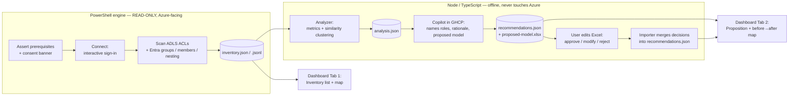

# ACLassist — ADLS ACL → RBAC Assessment Tool

**Phase 1 plan** · Last updated: 2026-07-15

> A portable, git‑delivered tool that (1) inventories the *actual* ADLS Gen2 + Entra ID
> permission/ACL structure and shows it to the customer, and (2) uses AI (via GitHub Copilot in
> the repo) to propose a simplified, RBAC‑style model — with the **customer in control** of every
> proposition. **Everything in Phase 1 is strictly READ‑ONLY.** Remediation (actually applying
> changes) is explicitly a later phase; Phase 1 only *prepares the field* for it.

---

## 1. Objective & scope

**Deliverable:** a two‑tab web dashboard plus the engine that feeds it, shipped as a published git
repo the customer clones, opens in VS Code, points at their environment, runs, and reviews.

| Tab | Purpose | Priority |
|---|---|---|
| **Tab 1 — Inventory** | Clear view of the *real* ACL/permission structure: searchable **list** + interactive **map** (folders ↔ groups ↔ users). An assessment/inventory the customer can trust. | **Primary** |
| **Tab 2 — Proposition** | AI reviews the whole inventory, finds redundancy/overlap and common access patterns, quantifies the sprawl ("retire ~N groups if…"), and proposes a simplified RBAC‑style model with a **before→after map**. Fully **user‑editable** via Excel. | Secondary |
| *Remediation* | Actually applying the approved model (manual / auto / batch / none). Schema and hooks are **prepared** but nothing is executed. | **Phase 2 (deferred)** |

---

## 2. Guiding constraints (non‑negotiable)

1. **READ‑ONLY, always.** The tool must never create, modify, move, or delete anything in Azure or
   Entra ID. Enforced by (a) read‑only APIs/cmdlets only, (b) read‑only Graph scopes,
   (c) a pre‑run consent banner, (d) a documented operation allowlist. No write path exists in the code.
2. **Customer notified before running** that the tool is harmless and non‑mutating (explicit banner + confirm).
3. **User in control.** AI *proposes*; the user approves/modifies/rejects everything (via Excel round‑trip).
4. **Portable.** Runs on a customer workstation with minimal prerequisites; dashboard is static and shareable.
5. **Runs in GHCP.** The AI assessment is driven by GitHub Copilot inside the repo (no API keys, no hosting).
6. **Scales to production.** Must handle **hundreds of thousands+ of paths** and tens of thousands of groups.
7. **Customer‑specified target.** User chooses tenant / subscription / ADLS account+container at run time.

---

## 3. Solution architecture



**Why this shape:** the only component that holds credentials and touches Azure is a small, auditable,
minimal‑dependency PowerShell extractor. Everything else works purely on local JSON and can be shared,
diffed, and re‑run offline. Copilot supplies the reasoning; deterministic code supplies the math.

---

## 4. Technology decisions

| Concern | Decision | Rationale / alternative |
|---|---|---|
| **Data flow** | Scan → JSON snapshot; dashboard & AI read the snapshot. | Decouples the networked scan from the shareable UI. |
| **Extractor runtime** | **PowerShell 7** (Az.Storage, Az.Accounts, Microsoft.Graph). | Signed, minimal, auditable deps; obvious read‑only cmdlet allowlist; trusted by enterprise security review. *Alt: unify on Node if preferred.* |
| **Analyzer + dashboard** | **Node/TypeScript**, **Vite + React** static SPA. | Rich interactive maps; builds to static assets (host on GitHub Pages **or** open a single‑file bundle). Air‑gapped from Azure. |
| **AI on Tab 2** | **GitHub Copilot agent in the repo** produces `recommendations.json` + `proposed-model.xlsx`. | No API keys, portable, "uses the AI power in GHCP." |
| **Analysis method** | **Hybrid** — deterministic clustering finds candidates + quantifies savings; AI names roles, writes rationale, proposes the model. | Repeatable numbers + human‑readable story. |
| **User control** | **Excel round‑trip** (`proposed-model.xlsx`) with decision columns; importer merges edits back. | User owns every change; prepares remediation fields without executing them. |
| **Auth** | Interactive **sign-in** (Azure + Microsoft Graph); optional saved **UPN login hint**. | No stored secret; needs **Storage Blob Data Reader** for the data plane. |
| **Prerequisites** | Bootstrapper validates the client and **offers to install** what's missing. | PowerShell 7, required modules, Node LTS. |

---

## 5. Proposed repository structure

```
acl-reporting/
  README.md                      # what it is, safety statement, quick start
  PLAN.md                        # this document
  docs/
    ARCHITECTURE.md
    SECURITY-READONLY.md         # the read-only guarantee + operation allowlist
    RUNBOOK.md                   # step-by-step for the customer
  config/
    config.sample.json           # tenant, subscription, storageAccount, container, filters, scale opts
  engine/                        # PowerShell — Azure-facing, READ ONLY
    Assert-Prerequisites.ps1     # checks PowerShell 5.1+ and Az/Graph modules; offers install
    Initialize-Config.ps1        # interactive setup -> config/config.json (git-ignored)
    Show-ReadOnlyConsent.ps1     # banner + explicit confirmation
    Connect-Target.ps1           # interactive sign-in (Azure + Microsoft Graph)
    Invoke-AclScan.ps1           # ADLS enumeration + getAccessControl (parallel, resumable)
    Invoke-GraphScan.ps1         # groups, transitive members, nesting, users
    Export-Inventory.ps1         # normalize -> inventory.json / .jsonl
    ReadOnly.Allowlist.psd1      # the only cmdlets/APIs the engine is permitted to call
  analyzer/                      # Node/TS — offline, never touches Azure
    package.json
    src/
      buildModel.ts              # tripartite graph users↔groups↔folders(ACEs)
      metrics.ts                 # sprawl KPIs
      clusterGroups.ts           # redundant/duplicate group detection (Jaccard on members + ACE sets)
      clusterPersonas.ts         # user role personas from effective access footprint
      collapsePermissions.ts     # R/W/X/RW/... -> Reader/Contributor/Owner per scope
      savings.ts                 # quantified before/after
      emit.ts                    # -> analysis.json
  ai/
    prompts/assess.prompt.md     # the Copilot prompt the customer runs in GHCP
    recommendations.schema.json  # contract the dashboard + Excel obey
    excel/exportModel.ts         # analysis + recommendations -> proposed-model.xlsx
    excel/importModel.ts         # edited xlsx -> merged recommendations.json
  web/                           # Vite + React static dashboard
    src/tabs/InventoryTab.tsx
    src/tabs/PropositionTab.tsx
    src/viz/{TreeMap,Heatmap,Sankey}.tsx
  data/                          # generated artifacts (gitignored)
    inventory.json | .jsonl
    analysis.json
    recommendations.json
    proposed-model.xlsx
  .github/
    copilot-instructions.md      # guardrails: read-only, how to run the AI tab
```

---

## 6. Component detail

### 6.1 Prerequisites bootstrapper
- Detects OS + PowerShell 7, required modules (Az.Accounts, Az.Storage, Microsoft.Graph), and Node LTS.
- Reports what's missing and **offers to install** (e.g., `winget install`, `Install-Module -Scope CurrentUser`).
- Never installs silently; user confirms each install.

### 6.2 Connection & authentication (read‑only)
- **Interactive sign‑in only:** device‑code / browser sign‑in for both Azure and Microsoft Graph. No SAS,
  no account keys, no stored secret; an optional saved **UPN login hint** pre‑fills the prompt.
- Graph always uses **read scopes**: `Directory.Read.All`, `Group.Read.All`, `GroupMember.Read.All`, `User.Read.All`.
- Azure data‑plane read via the signed‑in identity (needs **Storage Blob Data Reader**).
- **Network note:** if the ADLS uses a private endpoint, the engine must run where it can resolve/reach it
  (e.g., in‑network / on a jump host). This is a *placement* constraint, documented in the runbook.

### 6.3 Extraction engine — what it captures
- **Folders:** full path hierarchy (dept → area → layer → project → leaf).
- **ACLs:** **access ACEs and default (inherited) ACEs**; owner/owning‑group/permission bits; the named
  group/user ACEs per directory.
- **Existing Azure RBAC** data‑plane role assignments at account/container scope *(expected empty for this
  customer — captured defensively to prove it).*
- **Entra groups:** all `ADLS_*` and `PRD_*` (and any others in scope), **nesting**, and **transitive
  (effective) membership**.
- **Users:** memberships (direct + effective), job role, enabled/disabled.
- **Hygiene / liveness:** per-group effective-access `status` (active / dormant / unused), duplicate-grant groups, stale/disabled users.

### 6.4 Inventory data model (`inventory.json`)
Normalized entities with stable IDs so the analyzer and dashboard can join them:
- `folders[]` (path, depth, dept/area/layer/project, sensitivity)
- `groups[]` (name, objectId, naming kind: ADLS|PRD|other, **role**: access|role|hybrid|unused, **status**: active|dormant|unused, onAce, memberCount, reachable, nestedInto[])
- `users[]` (upn, objectId, jobRole, enabled, groupIds[])
- `aces[]` (folderId, principalId, principalType, permission r/w/x, aclType access|default)
- `rbacAssignments[]` (principalId, role, scope) — expected empty
- `meta` (target, scanTimestamp, counts, scale/sampling info)

At full scale, raw records stream to **JSONL**; the analyzer produces a compact aggregated dataset for
the browser (the dashboard loads summaries and lazy‑loads drill‑downs — it never loads hundreds of
thousands of rows at once).

### 6.5 Analyzer (deterministic)
- **Redundant/duplicate groups:** identical or ≥ threshold Jaccard similarity on member sets and/or ACE
  footprints → merge candidates.
- **Role personas:** cluster users by their effective access footprint (set of path+permission) →
  natural roles (e.g., "Finance Analyst", "Data Engineer").
- **Permission collapse:** the 7‑variant‑per‑folder pattern (R/W/X/RW/RX/WX/RWX) → standard
  Reader/Contributor/Owner per scope.
- **Quantified savings:** groups today → roles proposed; ACEs today → after; per‑user exceptions removed.
- Emits `analysis.json` with candidates + metrics + supporting evidence.

### 6.6 AI layer (Copilot in GHCP)
- The customer opens the repo and runs `ai/prompts/assess.prompt.md` with GitHub Copilot.
- Copilot reads the inventory summary + `analysis.json`, then: names roles sensibly, writes rationale,
  proposes the to‑be RBAC‑style model, and produces `recommendations.json` (obeying
  `recommendations.schema.json`) and the editable `proposed-model.xlsx`.

> **TODO (planned — not yet built): cross‑host workflow for Copilot‑less scan hosts.**
> The scan (M1) and analyzer (M3) run wherever the data lives — often a locked‑down VM / jump host with
> **no GitHub Copilot** — while the AI step (M4) needs a Copilot‑capable machine. Planned flow: run
> scan + analyzer on the scan host → copy the small **offline** artifacts (`data/analysis.json`,
> `data/inventory.json`, `data/inventory.jsonl`) to a workstation that has Copilot → run
> `ai/prompts/assess.prompt.md` there → carry `data/recommendations.json` (+ `data/proposed-model.xlsx`)
> back to open in the dashboard. Move the files via **RDP clipboard / drive redirection or Bastion —
> never git** (`data/` is git‑ignored and must never carry customer ACL data). A small helper to
> bundle/copy these artifacts — and/or a deterministic **`Invoke-Proposition.ps1`** for fully
> Copilot‑free environments — is a future add.

### 6.7 Excel round‑trip — the user is in control
`proposed-model.xlsx` sheets:
- **Proposed Roles** — new role, scope, permissions, member count, # groups replaced.
- **Group Consolidation Map** — old group → new role, `Decision` (Approve/Modify/Reject), notes.
- **User Reassignment** — user → old groups → new roles, `Decision`.
- **Savings Summary** — before/after totals.
- **Remediation fields (prepared, not executed):** `ApplyMode` (Manual/Auto/Batch/None), `Status`,
  target IDs — consumed by a *future* Phase‑2 engine only.

The user edits the workbook; `importModel.ts` reads it back (local file only, no Azure) and merges the
decisions into `recommendations.json`, which the dashboard then reflects (approved vs. proposed).

### 6.8 Dashboard
**Tab 1 — Inventory (primary):**
- **List:** searchable/filterable tables (folders, groups, users, ACEs) with facets (dept, layer,
  permission, sensitivity, orphaned/stale).
- **Map:** interactive, **aggregated with drill‑down** for scale — hierarchy treemap/icicle, a
  group×scope **heatmap**, and group→folder→user relationships.
- **KPIs:** # folders, # groups, # users, # ACEs, avg ACEs/folder, # dormant groups, sprawl index.

**Tab 2 — Proposition (secondary):**
- Findings: redundant groups, personas, consolidation opportunities, **quantified savings**.
- Proposed model + **before→after map** (Sankey old‑groups → new‑roles; side‑by‑side tree).
- Clear "you are in control" affordance linking to the Excel; shows approved vs. proposed.
- Remediation section visibly marked **Phase 2 — not executed here.**

---

## 7. Read‑only safety design (the important part)
- **Allowlist:** `engine/ReadOnly.Allowlist.psd1` enumerates the only permitted operations (all `Get-*` /
  list / `getAccessControl`). No `New-`/`Set-`/`Remove-`/`Update-`/`Move-` anywhere in the engine.
- **Scopes:** only Microsoft Graph read scopes are requested; the data plane uses the signed‑in identity (no SAS, no keys).
- **Consent banner:** before any call — *"This tool is READ‑ONLY. It enumerates ACLs, groups, and
  memberships. It will NOT create, modify, or delete anything. Continue? (y/N)."*
- **No remediation code path** exists in Phase 1 — apply logic is deferred to a separate, opt‑in Phase 2.
- **`docs/SECURITY-READONLY.md`** documents every operation for the customer's security review.

---

## 8. Scale & performance strategy (hundreds of thousands+ paths)
- Parallel, throttled enumeration (bounded concurrency) with **exponential backoff** on 429/503.
- **Checkpoint & resume:** persist visited paths so a scan can stop/restart without re‑walking.
- **Streaming output** to JSONL (never hold the whole estate in memory).
- **Graph `$batch`** + `transitiveMembers` with paging for effective membership.
- Analyzer produces **aggregated summaries + drill‑down shards** so the browser stays responsive.
- Validate correctness against the **lab** (~390 folders / ~2,300 groups / 50 users) first, then scale‑test.

---

## 9. Deliverables (Phase 1)
1. Published git repo (README + safety docs + runbook).
2. Read‑only PowerShell engine → `inventory.json`.
3. Node/TS analyzer → `analysis.json`.
4. Copilot assessment prompt + `recommendations.json` + editable `proposed-model.xlsx` + importer.
5. Portable Vite/React dashboard (Tab 1 inventory, Tab 2 proposition).
6. ~~Exportable executive summary + CSV~~ — **deferred** (post‑Phase 1).

---

## 10. Suggested build order (milestones)
1. **M0 — Repo scaffold** + safety docs + config schema + prereq bootstrapper.
2. **M1 — Extraction engine** (read‑only) producing `inventory.json`; validated on the lab.
3. **M2 — Dashboard Tab 1** (inventory list + map) over `inventory.json`.
4. **M3 — Analyzer** producing `analysis.json` (metrics + clustering + savings).
5. **M4 — AI layer**: Copilot prompt → `recommendations.json` + `proposed-model.xlsx` + importer.
6. **M5 — Dashboard Tab 2** (proposition + before→after map + Excel round‑trip).
7. **M6 — Scale hardening** (checkpoint/resume, throttling, aggregation) + exports + docs polish.

---

## 11. Decisions (resolved 2026-07-15)
1. **Extractor runtime = PowerShell 7.** ✅ Confirmed. Analyzer + dashboard remain Node/TypeScript.
2. **Hosting:** private repo for now. The tool is **portable** — the customer runs the same repo from
   **their own repo against their own environment**. We build/validate against **the lab** first. ✅
3. **Dashboard at full scale** shows **aggregates + drill‑down** (not every path at once). ✅
4. **Exports** (exec‑summary + CSV) → **deferred** (not in Phase 1). ✅ *(Removed from §9 deliverables.)*
5. **Test order:** validate on the **lab** first, then the customer runs it on their real environment. ✅

---

## 12. Risks & mitigations
| Risk | Mitigation |
|---|---|
| Private‑endpoint ADLS unreachable from a workstation | Runbook documents in‑network/jump‑host placement. |
| Enumeration cost at production scale | Concurrency + backoff + checkpoint/resume + streaming JSONL. |
| Browser can't render the full estate | Aggregated summaries + drill‑down shards. |
| Security team wary of a data‑plane tool | Minimal‑dependency auditable PowerShell + documented read‑only allowlist + consent banner. |
| AI proposals not trusted | Deterministic evidence behind every proposal + full user control via Excel; remediation deferred. |
```
