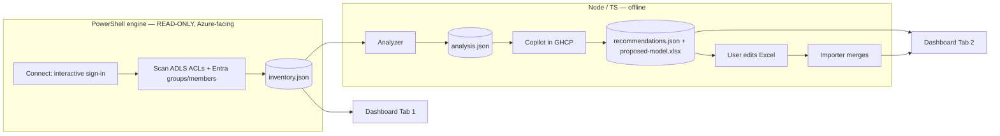

# Architecture

See [PLAN.md](../PLAN.md) for the full design. This is the condensed view.

## Principle: isolate the credential‑holding, Azure‑facing code
The only component that authenticates and reads from Azure/Entra is a small, auditable, **read‑only**
PowerShell engine. Everything else operates on local JSON files and never touches Azure.

## Components
- `engine/` — PowerShell extractor (read‑only) → `data/inventory.json`.
- `analyzer/` — Node/TS deterministic analysis → `data/analysis.json`.
- `ai/` — Copilot prompt + schema + Excel export/import (user control).
- `web/` — Vite + React static dashboard (Tab 1 inventory, Tab 2 proposition).
- `config/` — target + auth configuration (`config.json` is git‑ignored).
- `data/` — generated artifacts (git‑ignored).

## Scale
Enumeration is parallel + throttled with checkpoint/resume and streams to JSONL. The dashboard renders
aggregates with drill‑down rather than loading every path at once.
